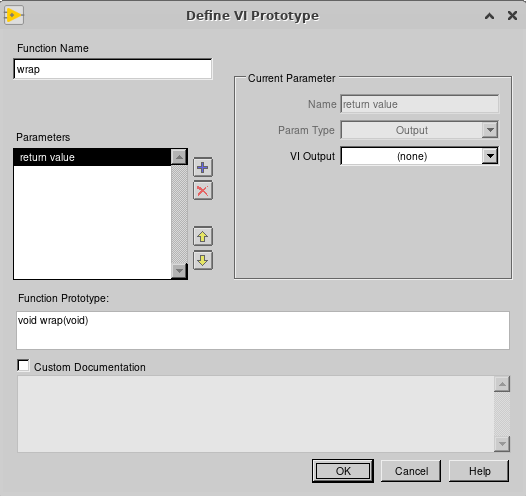
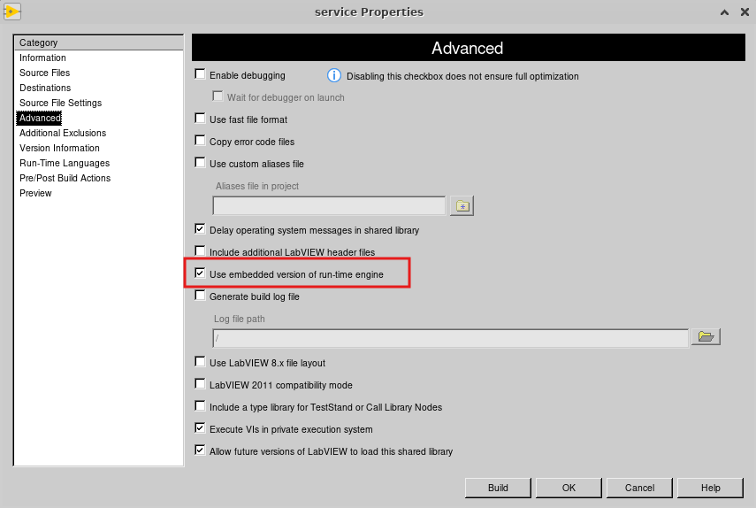

# run your LabVIEW built app as a service on Linux

## assumptions

- you can build your LabVIEW app on Linux
- your LabVIEW app can work without a UI

## create a "shared library"

- in the project, create a new build spec of type "shared library"

- in the **Source Files** section, select the main VI that you want to run and add it to the **Exported VIs** section

- in the **Define VI Prototype** window, set `Function Name = wrap`



- in the **Advanced** section, check the box for `Use embedded version of run-time engine` (Note: this option is only available in LabVIEW for Linux).



- build the shared library, this will build a number of file including
  - an.so file
  - an .h file
  - a .conf file

## create a c file to call your LabVIEW built shared library

In the build destination directory, you need to create a .c file with the following content

```c
#include "my-lv-app.h"
/* "my-lv-app.h " use the name of the .h file generated when building the LabVIEW shared library */

int main()
{
        wrap();
        return 0;
}
```

## compile you c file into an application

```bash
gcc -o g-procstat wrapper.c g-procstat.so -I /usr/local/natinst/LabVIEW-2020-64/cintools/
```

## creating a service file

Read systemd's doc or watch a youtube video, let me suggest this one

[](https://www.youtube.com/watch?v=fYQBvjYQ63U)
